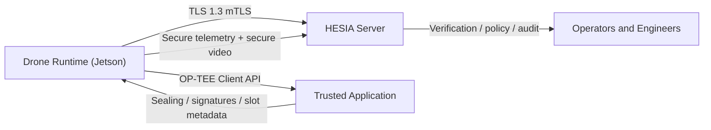

# HESIA Complete Reference EN

## Cover Page

**Project**: HESIA  
**Document version**: 2026-04-23  
**Language**: English  
**Scope**: firmware, server, OP-TEE TA, hardening, Jetson deployment,
maintenance, operations, embedded AI R&D  
**Audience**: firmware engineers, embedded security teams, Jetson platform
owners, operations teams, system architects, incoming maintainers

---

## Table of Contents

1. Project vision
2. Technical scope and positioning
3. Repository structure
4. System architecture
5. Trust boundaries and security model
6. Cryptographic chain
7. Drone firmware
8. HESIA server
9. Trusted Application and OP-TEE
10. Policies, signatures, and trust anchoring
11. Jetson Orin Nano Super target
12. Video and perception pipeline
13. Current AI stack and multimodal direction
14. Build, release, and deployment
15. systemd services and operations
16. Provisioning, keys, certificates, and sensitive material
17. Routine maintenance
18. Incident handling, diagnosis, and remediation
19. Validation and collected evidence
20. Known limitations
21. Firmware roadmap
22. Team handover guidance
23. Glossary
24. Practical appendices

---

## 1. Project vision

HESIA is an autonomous drone-control stack built as a security-sensitive
industrial product. It is not just a flight application and not just a vision
stack. The project combines a drone firmware runtime, a secure server runtime,
an OP-TEE trust anchor, signed security policy enforcement, GPU perception,
audit paths, runtime hardening, and an embedded multimodal R&D track.

The core goals are:

- maintain a drone-to-server link that is difficult to subvert
- make reverse engineering and operational compromise expensive
- keep the system credible for a hardened sovereign / defense-style posture
- document the full system well enough that a new engineering team can rebuild,
  maintain, and audit it without oral tribal knowledge

The repository should therefore be treated as a product engineering base, not a
single code module.

---

## 2. Technical scope and positioning

The current project scope includes:

- a Jetson-targeted C++ drone runtime
- a C++ secure-session server
- an OP-TEE trusted application and host utility
- signed security policies
- TLS 1.3 plus a PQC-authenticated HESIA session protocol
- a GPU perception pipeline currently centered on YOLO and MiDaS
- a parallel embedded multimodal R&D branch

The current scope does **not** yet fully include:

- a complete hardware-proven secure-boot chain on every target
- a true RPMB-backed rollback posture on the selected Jetson SD profile
- universal external HSM coverage for all production secrets
- full product replacement of the current perception/control logic by the new
  multimodal branch

So the present system is advanced, hardened, and operationally credible, but it
still reflects real hardware constraints on the selected Jetson deployment.

---

## 3. Repository structure

### 3.1 Top-level layout

- `drone_source/`
  - main drone firmware runtime
- `server_source/`
  - secure session server, support tooling, local UI
- `drone_transition_source/`
  - OP-TEE TA, host tool, Jetson validation and provisioning helpers
- `security/`
  - signed policy templates and service hardening assets
- `tools/`
  - release, deployment, reproducibility, and repo safety tooling
- `docs/`
  - handover manuals, operational guides, and engineering references
- `ml/`
  - embedded multimodal R&D, currently paused
- `papers/`
  - technical and research-style writeups
- `artifacts/`
  - generated evidence, benchmarks, exported model assets
- `heal-point/`
  - timestamped progress markers

### 3.2 Most critical files

The fastest way to understand product behavior is to study:

- `drone_source/drone_network.cpp`
- `drone_source/hesia_drone.cpp`
- `drone_source/secure_channel.cpp`
- `drone_source/video_manager.cpp`
- `drone_source/security_utils.cpp`
- `drone_source/optee_client.cpp`
- `server_source/src/hesia_server_session.cpp`
- `drone_transition_source/optee_ta_skeleton/ta/ta_hesia.c`
- `security/policies/jetson_orin_nano_super_runtime.policy.conf`

---

## 4. System architecture

### 4.1 Logical view



### 4.2 Transport sequence

The currently validated runtime sequence is:

1. TCP connect
2. TLS 1.3 handshake with mTLS
3. TLS exporter binding
4. HESIA message exchange:
   - `HELLO`
   - `HELLO_ACK`
   - `KEY_INIT`
   - `KEY_RESP`
   - `DRONE_AUTH`
   - `SERVER_AUTH`
   - `CONFIRM`
5. `SECURE_SESSION`
6. secure telemetry and secure video transfer

### 4.3 Responsibility split

- The drone initiates the connection, proves identity, and pushes telemetry and
  video.
- The server validates identity, evidence, and session state, then consumes the
  protected streams.
- The TA owns the functions that must remain outside ordinary Linux trust:
  sealing, identity signing, exported public anchors, challenge/recovery, and
  slot/rollback metadata.

---

## 5. Trust boundaries and security model

### 5.1 Base assumption

The system assumes:

- the TEE is the strongest trust anchor available on the target
- the normal Linux world is exposable and should not be treated as absolute
  trust
- policy must be verified before trusting runtime decisions
- the network is hostile by default

### 5.2 Trust zones

- **Strong trust zone**
  - OP-TEE TA
  - secrets and signing logic already internalized there
- **Hardened but not absolute**
  - drone runtime under Linux
  - server runtime under Linux
- **Untrusted by default**
  - network
  - arbitrary files
  - unsigned external input

### 5.3 Design principles

- explicit verification
- fail-closed behavior
- clear separation of control and video responsibilities
- signed policy enforcement
- embedded public verification roots
- out-of-repository secret provisioning

---

## 6. Cryptographic chain

### 6.1 Chosen primitives

The project keeps the currently selected primitive families:

- TLS 1.3 with mTLS
- ML-KEM-1024 for key establishment inside the HESIA protocol
- ML-DSA-87 for identity and session signatures
- Ed25519 for policy verification root
- AES-256-GCM for protected data channels
- SHA3-512 and HKDF-SHA3-512 in the HESIA session path

### 6.2 Primitive roles

- TLS 1.3:
  - transport confidentiality and peer authentication
  - transcript binding via exporter
- ML-KEM:
  - session material derivation within HESIA
- ML-DSA:
  - drone identity signatures
  - server identity signatures
  - session confirmation signatures
- Ed25519:
  - signed policy verification root
- AES-GCM:
  - protected application messages and video stream payloads

### 6.3 Realism policy

The project removed or reduced multiple “demo-grade” behaviors:

- no weak RNG fallback for secure channels
- no implicit fake GPS defaults
- no silent file replay without explicit enablement
- no pretending that software-side signing is a production TEE posture

---

## 7. Drone firmware

### 7.1 Entry points

- `drone_source/main.cpp`
- `drone_source/drone_network.cpp`
- `drone_source/hesia_drone.cpp`

### 7.2 Runtime responsibilities

The drone runtime:

- loads the signed policy
- prepares TLS material
- checks OP-TEE readiness in production posture
- establishes the HESIA handshake
- starts the clean perception pipeline
- sends secure telemetry and secure video
- enables runtime protection and sandboxing

### 7.3 Transport center of gravity

`DroneNetworkClient` is the key runtime orchestrator.

The most important functions are:

- `connect()`
- `handshake()`
- `send_message()`
- `enqueue_message()`
- `send_loop()`
- `send_secure_telemetry()`
- `send_video_frame()`
- `init_clean_pipeline()`

### 7.4 Active pipeline

The Jetson-validated production path is `CleanPipeline`.

It handles:

- video capture
- YOLO processing
- MiDaS processing
- frame callback into the network transport layer

The legacy path still exists in the repository, but the validated runtime path
is the clean pipeline initialized after the secure session comes up.

---

## 8. HESIA server

### 8.1 Main files

- `server_source/src/main.cpp`
- `server_source/src/hesia_server_session.cpp`

### 8.2 Responsibilities

The server:

- accepts TLS with mTLS
- verifies TLS exporter binding
- loads the pinned drone public key
- loads the pinned drone TEE public key
- loads the server ML-DSA identity from the OP-TEE server slot
- verifies `DRONE_AUTH`
- signs `SERVER_AUTH`
- receives and decrypts telemetry and video
- writes audit and proof-oriented logs

### 8.3 Session proof markers

The fastest operational markers are:

- `HELLO/ACK/KEY_INIT ok`
- `KEY_EXCHANGE ok`
- `DRONE_AUTH payload verified`
- `SERVER_AUTH frame sent`
- `SECURE_SESSION established`
- `CONST telemetry update ok`
- `VIDEO_DATA ok`

---

## 9. Trusted Application and OP-TEE

### 9.1 Why the TA exists

The TA concentrates the functions that are most dangerous if left entirely in
normal Linux memory:

- sealing and unsealing
- identity signing
- attestation anchor export
- recovery challenge flows
- session authentication gating
- slot and rollback metadata

### 9.2 Key files

- `drone_transition_source/optee_ta_skeleton/ta/include/ta_hesia.h`
- `drone_transition_source/optee_ta_skeleton/ta/ta_hesia.c`
- `drone_transition_source/optee_ta_skeleton/host/main.c`
- `drone_source/optee_client.cpp`

### 9.3 Major capabilities

- import of sealed ML-DSA key material
- export of ML-DSA public keys
- ML-DSA signing inside the TA
- export of attestation anchors
- recovery challenge generation
- staged A/B slot metadata handling

### 9.4 Important hardware limitation

The selected Jetson Orin Nano Super SD profile does not expose RPMB in the way
required for the strict rollback profile. The deployed policy must remain honest
about that limitation.

---

## 10. Policies, signatures, and trust anchoring

### 10.1 Policy as contract

The security policy is a signed runtime contract. It:

- enables or disables hardware-dependent requirements
- controls transport and queue thresholds
- defines trust expectations around TEE, boot, release, and audit

### 10.2 Reference policy file

- `security/policies/jetson_orin_nano_super_runtime.policy.conf`

### 10.3 Notable values on the current Jetson target

Examples:

- `drone.require_tee_hkdf=0`
- `drone.require_rpmb_rollback_storage=0`
- `drone.video_send_queue_max=96`
- `drone.video_min_send_interval_ms=200`

Those settings are intentional. They align the deployed security posture with
the actual hardware and the observed runtime behavior of the target. The move
to `200 ms` was kept after Jetson validation to reduce pressure on the server
hot path during long file-replay sessions.

---

## 11. Jetson Orin Nano Super target

### 11.1 Target role

The Jetson is the active execution target for the hardened drone firmware:

- GPU-backed perception
- Linux runtime
- OP-TEE integration
- systemd-managed services

### 11.2 Operational paths

- runtime mirror / shared assets:
  - `/home/ajax/.cache/.hesia/src`
- live rebuild worktree for the drone:
  - `/home/ajax/.cache/.hesia/work/runtime_20260420/drone_source`
- live rebuild worktree for the server:
  - `/home/ajax/.cache/.hesia/work/runtime_20260420/server_source`
- shared video replay:
  - `/home/ajax/.cache/.hesia/src/videos/DRONE2.mp4`
- build root:
  - `/home/ajax/.cache/.hesia/build`
- deployed binary:
  - `/opt/hesia/bin/hesia_drone`
  - `/opt/hesia/lib/libhesia_sentinel.so`
- environment:
  - `/etc/hesia/hesia.env`
- policy:
  - `/etc/hesia/policy/policy.conf`
- logs:
  - `/var/log/hesia/`

### 11.3 Services

- `hesia-drone.service`
- `hesia-server.service`

### 11.4 systemd hardening

Important service-level hardening already in use:

- `NoNewPrivileges=yes`
- `PrivateTmp=yes`
- `ProtectSystem=full`
- `ProtectHome=read-only`
- `RestrictNamespaces=yes`
- `ProtectKernelTunables=yes`

### 11.5 Recent validated state

On the target, the following were validated:

- services active under systemd
- HESIA handshake established
- telemetry received by the server
- `VIDEO_DATA ok` present in server logs
- file replay configured explicitly
- `HESIA_FILE_VIDEO_LOOP=1` enabled for the current validation target
- replay looping validated across multiple iterations
- long-duration transport validation documented in
  `docs/HESIA_JETSON_TRANSPORT_SOAK_2026-04-23.md`
- repeated OP-TEE `recovery_challenge` noise removed from the final soak window

---

## 12. Video and perception pipeline

### 12.1 Capture rules

Video must come from either:

- an explicit camera source `camera:<index>`
- an explicit file source that is allowed on purpose

Implicit fallbacks are not acceptable for the current product posture.

### 12.2 File replay mode

File replay exists for:

- Jetson validation
- controlled demonstrations
- end-to-end pipeline testing

Looping is now explicit through:

- `HESIA_FILE_VIDEO_LOOP=1`

### 12.3 YOLO and MiDaS

The current pipeline computes:

- YOLO detections and tracking state
- MiDaS depth state
- a composed frame for server transmission

### 12.4 Expected runtime path

On a healthy target:

- a frame is captured
- processed by the pipeline
- encoded as JPEG
- packed as `VIDEO_DATA`
- encrypted and sent to the server

---

## 13. Current AI stack and multimodal direction

### 13.1 Current product state

The present product path still relies on:

- convolutional perception components
- the current sequence/control logic
- MiDaS for depth

### 13.2 R&D direction

A separate branch under `ml/hesia_m2b` exists for:

- compact multimodal models
- Mamba-2 / BitNet-inspired experiments
- ONNX export
- Jetson TensorRT validation
- a mission-capable branch with low-level actuator outputs

### 13.3 Current status

That R&D branch is **paused** by current instruction. It should not be marketed
or described as the active production path yet.

---

## 14. Build, release, and deployment

### 14.1 Key tooling

- `tools/build_hesia_cloaked_release.sh`
- `tools/deploy_hesia_release.sh`
- `tools/measure_release_artifact.py`

### 14.2 Release philosophy

The project aims for:

- stripped binaries
- separated debug sidecars
- hardened compile and link posture
- deployment under `/opt/hesia/bin`
- deployment of the Sentinel runtime library under `/opt/hesia/lib`

### 14.3 Recent Jetson build

The validated Jetson rebuilds were performed from the live worktrees:

- `/home/ajax/.cache/.hesia/work/runtime_20260420/drone_source`
- `/home/ajax/.cache/.hesia/work/runtime_20260420/server_source`

with build directories:

- `/home/ajax/.cache/.hesia/build/drone-cloaked-cfi-20260420/`
- `/home/ajax/.cache/.hesia/build/server-cloaked-tee-20260420/`

They were then redeployed to:

- `/opt/hesia/bin/hesia_drone`
- `/opt/hesia/bin/hesia_server_cpp`
- `/opt/hesia/lib/libhesia_sentinel.so`

### 14.4 Build discipline

- always identify which build tree backs the deployed binary
- do not assume local Windows builds match Jetson runtime behavior
- verify hashes before and after deployment when release integrity matters

---

## 15. systemd services and operations

### 15.1 Drone service

Key points:

- `WorkingDirectory=/home/ajax/.cache/.hesia/src/drone`
- `EnvironmentFile=-/etc/hesia/hesia.env`
- `ExecStart=/opt/hesia/bin/hesia_drone`

The `WorkingDirectory` is still used for runtime assets, but the validated
rebuild workflow operated from
`/home/ajax/.cache/.hesia/work/runtime_20260420/drone_source`.

### 15.2 Server service

Key points:

- deployed binary under `/opt/hesia/bin/hesia_server_cpp`
- systemd logs are complemented by per-session files in
  `/var/log/hesia/drone/`

### 15.3 Common operational commands

```bash
systemctl status hesia-drone.service --no-pager
systemctl status hesia-server.service --no-pager
journalctl -u hesia-drone.service -n 200 --no-pager
journalctl -u hesia-server.service -n 200 --no-pager
```

---

## 16. Provisioning, keys, certificates, and sensitive material

### 16.1 Absolute rule

Production secrets must not be managed as ordinary repository artifacts.

### 16.2 Sensitive material classes

- private TLS certificates
- private ML-DSA identity material
- sealed blobs
- OP-TEE session-auth secret material
- audit and rotation keys

### 16.3 Target directories

- `/etc/hesia/secure`
- `/etc/hesia/certs`
- `/etc/hesia/policy`

### 16.4 Handover rule

Document paths and workflows, not secret contents.

---

## 17. Routine maintenance

### 17.1 Daily checks

- service state
- log presence
- recent `VIDEO_DATA ok`
- recent `SECURE_SESSION established`
- integrity of `secure_dir`

### 17.2 Post-change checks

- rebuild the correct artifact
- redeploy to the expected target path
- restart systemd services
- re-read drone and server logs
- validate policy alignment

### 17.3 Rotation

Rotation tooling already exists for:

- drone identity
- server keys
- TA-backed sensitive material

Run those only in a controlled maintenance window.

---

## 18. Incident handling, diagnosis, and remediation

### 18.1 Session does not come up

Check for:

- TLS failure
- exporter binding failure
- invalid `DRONE_AUTH`
- missing `SERVER_AUTH`
- policy mismatch
- pinned public key mismatch

### 18.2 Video missing

Check:

- `HESIA_VIDEO_SOURCE`
- source accessibility
- `HESIA_ALLOW_FILE_VIDEO_SOURCE`
- `HESIA_FILE_VIDEO_LOOP`
- `VIDEO_DATA ok` on the server side

### 18.3 OP-TEE failures

Check:

- session-auth secret readiness
- file permissions under `secure_dir`
- exported public anchors
- ML-DSA slot state

### 18.4 Backpressure and send queue symptoms

Possible symptoms:

- `Drop frame (queue full)`
- `Drop message (queue full) type=SECURE_MSG`
- `transport_write_all failed`

Actions:

- correlate with server-side logs
- inspect `video_send_queue_max`
- inspect `video_min_send_interval_ms`
- confirm whether the server is still receiving `VIDEO_DATA ok`
- reduce rate or refine backpressure logic if the issue is sustained
- verify that the fast-fail transport shutdown path is still active so that a
  broken connection does not turn into a prolonged log storm

On the validated 2026-04-23 Jetson target, the reference value for
`video_min_send_interval_ms` is `200`.

---

## 19. Validation and collected evidence

### 19.1 What has been proven

- Jetson SSH access
- active systemd services
- full HESIA handshake
- telemetry received by the server
- video received by the server
- cloaked drone build redeployed
- file replay under explicit environment control
- fast-fail transport teardown redeployed to reduce error storms after a
  confirmed transport break
- transport and telemetry stability over about `67 minutes` on the restarted
  final window
- replay-loop validation without EOF across multiple iterations
- final soak window without repeated `recovery_challenge` errors
- `60` samples collected on the final restarted window
- `7` replay-loop iterations observed on the final restarted window

### 19.2 Primary evidence sources

- `journalctl -u hesia-drone.service`
- `journalctl -u hesia-server.service`
- `/var/log/hesia/drone/SERVERCPP.*.log`
- `docs/HESIA_JETSON_BASELINE_2026-04-20.md`
- `docs/HESIA_JETSON_TRANSPORT_SOAK_2026-04-23.md`
- `artifacts/jetson_transport_soak/2026-04-23_20-23-52_final/summary.json`
- `artifacts/jetson_transport_soak/2026-04-23_20-37-38_manual/report.md`
- `artifacts/jetson_transport_soak/2026-04-23_21-04-16_manual/report.md`
- `artifacts/jetson_transport_soak/2026-04-23_21-55-59/report.md`

### 19.3 Proof discipline

Valid proof should be:

- timestamped
- reproducible
- backed by a log, build, artifact, or direct target check

An intuition without corroboration is not operational evidence.

### 19.4 Fine Jetson transport correlation

The 2026-04-23 validation establishes three distinct facts:

1. secure transport and telemetry were already stable for a long window even
   before the replay fix
2. the useful video fix was the file-loop behavior inside the actually deployed
   binary, not a TLS or HESIA repair
3. after the replay fix and the OP-TEE attestation-noise fix, the final window
   keeps transport, telemetry, and video healthy without repeated errors
4. the restarted final window adds a stronger proof over more than one hour of
   runtime, with `60` samples and `7` observed replay loops

The detailed narrative and timestamps are captured in
`docs/HESIA_JETSON_TRANSPORT_SOAK_2026-04-23.md`.

---

## 20. Known limitations

### 20.1 Hardware constraints

- no usable RPMB on the chosen Jetson profile
- rollback posture adapted accordingly

### 20.2 Product constraints

- the validated Jetson profile still uses file replay for video demonstration
  and pipeline validation
- direct TEE attestation-public-key export is not available on the current
  target; when needed, runtime falls back once at startup to the pinned P-256
  attestation public key
- full migration to the future multimodal stack is not complete

### 20.3 Security honesty

The system is strongly hardened, but it must not be described as invulnerable.
Its credibility depends on technical honesty and proof-backed claims.

---

## 21. Firmware roadmap

The rational next order is:

1. keep a Jetson soak validation after each sensitive release change
2. continue removing soft fallback paths
3. strengthen release and rotation discipline
4. keep documentation synchronized with reality
5. only then return to multimodal runtime integration

---

## 22. Team handover guidance

### 22.1 What a new team should read first

1. this document
2. `docs/HESIA_ENGINEERING_MANUAL.md`
3. `docs/HESIA_INSTALLATION_GUIDE.md`
4. `docs/HESIA_OPERATIONS_RUNBOOK.md`
5. `docs/HESIA_TA_OPTEE_REFERENCE.md`
6. `AGENTS/memory.md`

### 22.2 What they should verify next

- Jetson accessibility
- deployed binary versus source build alignment
- target production policy alignment
- presence of public anchors and sealed assets
- real service health on target

### 22.3 What they must not do

- deploy unsigned policy
- reintroduce “demo” fallback behavior
- assume every local artifact is deployed on target
- delete proof artifacts without archiving

---

## 23. Glossary

- **TA**: OP-TEE Trusted Application
- **REE**: Rich Execution Environment, the normal Linux world
- **TEE**: Trusted Execution Environment
- **mTLS**: mutual TLS
- **ML-KEM**: post-quantum key establishment primitive
- **ML-DSA**: post-quantum signature primitive
- **Policy**: signed runtime security contract
- **File replay**: explicit video playback from a file source
- **Backpressure**: queue pressure when data production exceeds egress capacity

---

## 24. Practical appendices

### 24.1 Useful Jetson commands

```bash
systemctl is-active hesia-drone.service
systemctl is-active hesia-server.service
journalctl -u hesia-drone.service -n 120 --no-pager
journalctl -u hesia-server.service -n 120 --no-pager
cat /etc/hesia/hesia.env
cat /etc/hesia/policy/policy.conf
ls -l /opt/hesia/bin
ls -l /var/log/hesia
```

### 24.2 Critical environment variables

```text
HESIA_BASE_DIR
HESIA_VIDEO_SOURCE
HESIA_ALLOW_FILE_VIDEO_SOURCE
HESIA_FILE_VIDEO_LOOP
HESIA_GPS_FIX_PATH
HESIA_M2B_TRACE
HESIA_M2B_TRACE_DIR
```

### 24.3 Files to watch

```text
/etc/hesia/hesia.env
/etc/hesia/policy/policy.conf
/etc/hesia/secure/*
/opt/hesia/bin/hesia_drone
/opt/hesia/bin/hesia_server_cpp
/opt/hesia/lib/libhesia_sentinel.so
/var/log/hesia/*
```

---

## Closing note

HESIA should be maintained as a secured embedded system, not as a generic app.
Its value comes from the combination of:

- secure session design
- OP-TEE anchoring
- GPU perception pipeline
- disciplined deployment
- hardened release practice
- transfer-grade documentation

The best next move is not complexity for its own sake. The best next move is to
keep the system honest, hardened, evidenced, and maintainable, with every claim
strictly aligned to concrete proof.
