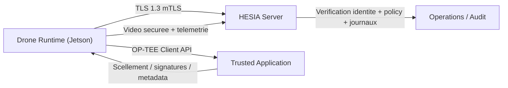

# HESIA Reference Complete FR

## Page de garde

**Projet**: HESIA  
**Version du document**: 2026-04-23  
**Langue**: Francais  
**Portee**: firmware, serveur, TA OP-TEE, durcissement, deploiement Jetson,
maintenance, operations, R&D IA embarquee  
**Public cible**: ingenieurs firmware, securite embarquee, plateforme Jetson,
operations, architecture systeme, reprise de projet

---

## Sommaire

1. Vision du projet
2. Perimetre et positionnement technique
3. Arborescence du depot
4. Architecture systeme
5. Frontieres de confiance et modele de securite
6. Chaine cryptographique
7. Firmware drone
8. Serveur HESIA
9. Trusted Application et OP-TEE
10. Policies, signatures et ancrage de confiance
11. Jetson Orin Nano Super
12. Pipeline video et perception embarquee
13. AI actuelle et trajectoire multimodale
14. Build, release et deploiement
15. Services systemd et exploitation
16. Provisioning, clefs, certificats et materiel sensible
17. Maintenance courante
18. Incidents, diagnostic et remediation
19. Validation et preuves collectees
20. Limites connues
21. Feuille de route firmware
22. Reprise d’equipe
23. Glossaire
24. Annexes pratiques

---

## 1. Vision du projet

HESIA est un systeme de controle de drone autonome orienté produit industriel
sensible. Il ne s’agit pas uniquement d’un logiciel de vol ou d’une stack de
vision: le projet assemble un firmware drone, un serveur securise, un ancrage
de confiance dans un TEE OP-TEE, une politique de securite signee, un pipeline
de perception GPU, des mecanismes d’audit, de hardening et une trajectoire R&D
vers une pile multimodale embarquee.

Les objectifs structurants sont:

- maintenir un lien drone-serveur difficile a subvertir
- rendre la compromission logique et la reingenierie couteuses
- conserver une base credible pour du durcissement defense / souverain
- documenter suffisamment l’ensemble pour qu’une nouvelle equipe puisse
  reconstruire, maintenir et auditer sans connaissance implicite

Le depot n’est donc pas seulement une base de code. C’est un ensemble de
sources, scripts, preuves, artefacts et manuels de transfert.

---

## 2. Perimetre et positionnement technique

Le perimetre actuel couvre:

- un runtime drone C++ pour Jetson
- un runtime serveur C++
- une Trusted Application OP-TEE et son host tool
- une politique de securite signee
- une gestion de sessions securisees avec TLS 1.3 puis protocole HESIA
- un pipeline de vision base sur YOLO et MiDaS
- une branche R&D multimodale compacte destinee a remplacer une partie de la
  logique perception + sequence a moyen terme

Le perimetre n’inclut pas encore:

- une chaine Secure Boot materielle complete prouvee sur toutes cibles
- un profil RPMB reel sur la cible Jetson Orin Nano Super SD retenue
- un HSM externe complet pour tous les secrets de production
- une migration totale du produit vers le futur modele multimodal

Le systeme actuel est donc un produit de niveau avance, durci et credible,
mais encore conditionne par certaines contraintes materielle de la cible Jetson
retenue.

---

## 3. Arborescence du depot

### 3.1 Vue d’ensemble

- `drone_source/`
  - coeur du firmware drone
- `server_source/`
  - serveur C++, verification session, UI locale, gestion policy
- `drone_transition_source/`
  - TA OP-TEE, host tool, scripts de provisioning et de validation Jetson
- `security/`
  - templates de policy et d’integration systemd
- `tools/`
  - build, deployment, mesure, reproductibilite, hygiene repo
- `docs/`
  - documentation technique, guides d’exploitation et manuels de reprise
- `ml/`
  - R&D IA embarquee, actuellement en pause
- `papers/`
  - rapports techniques et notes de recherche
- `artifacts/`
  - preuves generees, benchmarks, export ONNX/TensorRT, captures
- `heal-point/`
  - notes de progression horodatees

### 3.2 Sous-ensembles critiques

Les fichiers les plus critiques pour comprendre le comportement produit sont:

- `drone_source/drone_network.cpp`
- `drone_source/hesia_drone.cpp`
- `drone_source/secure_channel.cpp`
- `drone_source/video_manager.cpp`
- `drone_source/security_utils.cpp`
- `drone_source/optee_client.cpp`
- `server_source/src/hesia_server_session.cpp`
- `drone_transition_source/optee_ta_skeleton/ta/ta_hesia.c`
- `security/policies/jetson_orin_nano_super_runtime.policy.conf`

---

## 4. Architecture systeme

### 4.1 Vue logique



### 4.2 Enchainement de transport

Le transport valide en production actuelle suit cet ordre:

1. connexion TCP
2. handshake TLS 1.3 avec mTLS
3. binding du transcript TLS via exporter
4. echange HESIA:
   - `HELLO`
   - `HELLO_ACK`
   - `KEY_INIT`
   - `KEY_RESP`
   - `DRONE_AUTH`
   - `SERVER_AUTH`
   - `CONFIRM`
5. ouverture de `SECURE_SESSION`
6. envoi de telemetrie securee et de `VIDEO_DATA`

### 4.3 Separation fonctionnelle

- Le drone initie la connexion, prouve son identite et pousse telemetrie +
  video.
- Le serveur valide identite, session, ancrages et policy, puis consomme les
  flux.
- La TA OP-TEE detient les fonctions de confiance: scellement, signatures,
  export d’ancres, metadata de rollback et authentification de session TA.

---

## 5. Frontieres de confiance et modele de securite

### 5.1 Hypothese de base

Le systeme presume que:

- le TEE offre la meilleure ancre de confiance disponible sur la cible
- le monde normal Linux reste exposable, donc tout ce qui y vit doit etre limite
- la politique de securite doit etre verifiee avant de faire confiance au reste
- le lien reseau n’est jamais implicitement de confiance

### 5.2 Zones de confiance

- **Zone forte**:
  - TA OP-TEE
  - materiel de session et de signature qui y est internalise
- **Zone durcie mais non absolue**:
  - runtime drone Linux
  - runtime serveur Linux
- **Zone non fiable par defaut**:
  - reseau
  - fichiers utilisateurs
  - toute entree exogene non signee

### 5.3 Principes de conception retenus

- verification explicite
- fail-closed
- separation control plane / video plane dans la logique applicative
- policies signees
- ancrage public embarque pour verification des policies
- rotation et provisionnement hors depot pour les secrets

---

## 6. Chaine cryptographique

### 6.1 Primitives retenues

Le projet conserve les familles cryptographiques deja choisies:

- TLS 1.3 avec mTLS
- ML-KEM-1024 pour l’etablissement de clef dans le protocole HESIA
- ML-DSA-87 pour les signatures d’identite et de session
- Ed25519 pour la racine de verification des policies
- AES-256-GCM pour les canaux de donnees
- SHA3-512 et HKDF-SHA3-512 dans le chemin HESIA

### 6.2 Roles des primitives

- TLS 1.3:
  - protege le tunnel de transport
  - ajoute le binding exporter
- ML-KEM:
  - derive la matiere de session HESIA
- ML-DSA:
  - signe identite drone, identite serveur, confirmations de session
- Ed25519:
  - verifie la policy signee embarquee
- AES-GCM:
  - protege les messages applicatifs et le flux video

### 6.3 Politique de realisme

Le projet a abandonne plusieurs chemins “factice/prototype”:

- plus de replay video implicite sans variable explicite
- plus de fallback RNG faible
- plus de faux GPS par defaut
- plus de soft-sign REE considere comme “production” sans garde explicite

---

## 7. Firmware drone

### 7.1 Entrees principales

- `drone_source/main.cpp`
- `drone_source/drone_network.cpp`
- `drone_source/hesia_drone.cpp`

### 7.2 Responsabilites du runtime

Le runtime drone:

- charge la policy signee
- prepare TLS et les certificats
- verifie la readiness OP-TEE en production
- etablit le handshake HESIA
- demarre le pipeline clean de perception
- envoie telemetrie et flux video
- active les protections runtime et les sandboxes

### 7.3 Gestion des flux

Le coeur transport reside dans `DroneNetworkClient`.

Ses fonctions structurantes:

- `connect()`
- `handshake()`
- `send_message()`
- `enqueue_message()`
- `send_loop()`
- `send_secure_telemetry()`
- `send_video_frame()`
- `init_clean_pipeline()`

### 7.4 Pipeline de perception actif

Le chemin actif sur Jetson est `CleanPipeline`.

Il orchestre:

- capture video
- passage YOLO
- passage MiDaS
- callback reseau pour la frame concatenee / reduite

Le pipeline historique existe encore dans le depot mais le chemin produit valide
est celui du CleanPipeline.

---

## 8. Serveur HESIA

### 8.1 Entrees principales

- `server_source/src/main.cpp`
- `server_source/src/hesia_server_session.cpp`

### 8.2 Fonction

Le serveur:

- accepte le TLS mTLS
- verifie l’exporter TLS
- charge la cle publique drone epinglee
- charge l’ancre TEE epinglee
- charge son identite ML-DSA depuis OP-TEE
- valide `DRONE_AUTH`
- signe `SERVER_AUTH`
- decrypte telemetrie et video
- ecrit des journaux orientés preuve et exploitation

### 8.3 Indicateurs de bonne session

Les marqueurs a rechercher en priorite:

- `HELLO/ACK/KEY_INIT ok`
- `KEY_EXCHANGE ok`
- `DRONE_AUTH payload verified`
- `SERVER_AUTH frame sent`
- `SECURE_SESSION established`
- `CONST telemetry update ok`
- `VIDEO_DATA ok`

---

## 9. Trusted Application et OP-TEE

### 9.1 Raison d’etre

La TA concentre les fonctions dont la compromission dans le monde normal serait
la plus critique:

- scellement
- export d’ancres
- signatures d’attestation
- signatures ML-DSA
- metadata de slots et de rollback
- secret d’authentification de session TA

### 9.2 Fichiers clefs

- `drone_transition_source/optee_ta_skeleton/ta/include/ta_hesia.h`
- `drone_transition_source/optee_ta_skeleton/ta/ta_hesia.c`
- `drone_transition_source/optee_ta_skeleton/host/main.c`
- `drone_source/optee_client.cpp`

### 9.3 Capacites majeures

- import de clef ML-DSA scellee
- export de clef publique ML-DSA
- signature ML-DSA dans la TA
- export d’ancres d’attestation
- challenge de recovery
- staging de slots A/B

### 9.4 Limite materielle importante

Le profil Jetson Orin Nano Super retenu ici ne dispose pas du support RPMB
necessaire pour un profil rollback “etat de l’art”. Le systeme ne doit pas
pretendre le contraire dans la policy de cette release.

---

## 10. Policies, signatures et ancrage de confiance

### 10.1 Principes

La policy est un contrat de securite versionne et signe. Elle:

- active ou interdit certaines exigences
- ajuste la posture au materiel reel
- controle les limites de transport et de queue
- encode les exigences OP-TEE, boot, release et audit

### 10.2 Fichier de reference

- `security/policies/jetson_orin_nano_super_runtime.policy.conf`

### 10.3 Valeurs importantes sur la cible Jetson actuelle

Exemples notables:

- `drone.require_tee_hkdf=0`
- `drone.require_rpmb_rollback_storage=0`
- `drone.video_send_queue_max=96`
- `drone.video_min_send_interval_ms=200`

Ces choix ne sont pas des concessions arbitraires. Ils servent a aligner la
policy sur les capacites reelles de la cible et sur la stabilite observee.
Le passage a `200 ms` a ete retenu apres validation Jetson afin de lisser la
pression sur le hot path serveur pendant les longues sequences de replay
fichier.

---

## 11. Jetson Orin Nano Super

### 11.1 Role de la cible

Le Jetson sert de plateforme d’execution du firmware drone durci:

- GPU pour YOLO / MiDaS / TensorRT
- Linux embarque
- OP-TEE integre
- services systemd

### 11.2 Chemins utiles

- miroir runtime / assets:
  - `/home/ajax/.cache/.hesia/src`
- worktree live utilise pour rebuild drone:
  - `/home/ajax/.cache/.hesia/work/runtime_20260420/drone_source`
- worktree live utilise pour rebuild serveur:
  - `/home/ajax/.cache/.hesia/work/runtime_20260420/server_source`
- video de replay:
  - `/home/ajax/.cache/.hesia/src/videos/DRONE2.mp4`
- builds:
  - `/home/ajax/.cache/.hesia/build`
- binaire deploye:
  - `/opt/hesia/bin/hesia_drone`
  - `/opt/hesia/lib/libhesia_sentinel.so`
- env:
  - `/etc/hesia/hesia.env`
- policy:
  - `/etc/hesia/policy/policy.conf`
- logs:
  - `/var/log/hesia/`

### 11.3 Services

- `hesia-drone.service`
- `hesia-server.service`

### 11.4 Durcissement systemd

Le service drone active notamment:

- `NoNewPrivileges=yes`
- `PrivateTmp=yes`
- `ProtectSystem=full`
- `ProtectHome=read-only`
- `RestrictNamespaces=yes`
- `ProtectKernelTunables=yes`

### 11.5 Etat valide recent

Etat confirme sur cible:

- services actifs
- handshake HESIA etabli
- telemetrie recue
- `VIDEO_DATA ok`
- replay video configure sur fichier explicite
- `HESIA_FILE_VIDEO_LOOP=1` active pour cette cible de validation
- bouclage replay valide sur plusieurs iterations
- longue validation de transport documentee dans
  `docs/HESIA_JETSON_TRANSPORT_SOAK_2026-04-23.md`
- bruit OP-TEE `recovery_challenge` repete supprime de la fenetre de soak
  finale

---

## 12. Pipeline video et perception embarquee

### 12.1 Capture

La capture provient soit:

- d’une camera explicite `camera:<index>`
- d’un fichier explicitement autorise

Les chemins faux ou implicites ne doivent pas etre utilises.

### 12.2 Replay fichier

Le replay fichier sert a:

- validation Jetson
- demonstration controlee
- tests d’integration du pipeline complet

Le mode de bouclage est maintenant explicite via:

- `HESIA_FILE_VIDEO_LOOP=1`

### 12.3 YOLO et MiDaS

Le pipeline actuel calcule:

- un resultat detection/tracking YOLO
- un resultat profondeur MiDaS
- une frame composee destinee a l’envoi serveur

### 12.4 Comportement attendu

Sur une cible saine:

- la frame est traitee
- encodee en JPEG
- encapsulee en `VIDEO_DATA`
- chiffree et transmise

---

## 13. IA actuelle et trajectoire multimodale

### 13.1 Etat present

Le produit embarque aujourd’hui:

- deux branches convolutionnelles operationnelles dans le pipeline
- une logique sequentielle historique
- MiDaS conserve pour la profondeur

### 13.2 Trajectoire R&D

Une branche R&D parallele existe dans `ml/hesia_m2b`:

- modele multimodal compact
- experiments de type Mamba-2 / BitNet-inspired
- export ONNX
- validation TensorRT Jetson
- branche mission avec sorties bas niveau

### 13.3 Statut au moment de ce document

La R&D est **en pause** pour prioriser:

- firmware
- deploiement Jetson
- documentation de reprise

Il ne faut pas promettre que cette branche remplace deja la chaine produit.

---

## 14. Build, release et deploiement

### 14.1 Outils clefs

- `tools/build_hesia_cloaked_release.sh`
- `tools/deploy_hesia_release.sh`
- `tools/measure_release_artifact.py`

### 14.2 Philosophie de release

Le projet vise:

- binaries strippees
- symboles debug separes
- durcissement de link et de compilation
- deploiement cible sous `/opt/hesia/bin`
- deploiement de la librairie Sentinel sous `/opt/hesia/lib`

### 14.3 Build Jetson recent

Les rebuilds valides sur Jetson ont ete faits depuis les worktrees live:

- `/home/ajax/.cache/.hesia/work/runtime_20260420/drone_source`
- `/home/ajax/.cache/.hesia/work/runtime_20260420/server_source`

avec les repertoires de build:

- `/home/ajax/.cache/.hesia/build/drone-cloaked-cfi-20260420/`
- `/home/ajax/.cache/.hesia/build/server-cloaked-tee-20260420/`

Puis redeployes vers:

- `/opt/hesia/bin/hesia_drone`
- `/opt/hesia/bin/hesia_server_cpp`
- `/opt/hesia/lib/libhesia_sentinel.so`

### 14.4 Conseils de build

- toujours rebuild dans le repertoire de build effectivement utilise
- verifier quel build correspond au binaire deploye avant de toucher `/opt`
- ne pas supposer qu’un build local Windows equivaut a la cible Jetson

---

## 15. Services systemd et exploitation

### 15.1 Service drone

Points d’attention:

- `WorkingDirectory=/home/ajax/.cache/.hesia/src/drone`
- `EnvironmentFile=-/etc/hesia/hesia.env`
- `ExecStart=/opt/hesia/bin/hesia_drone`

Le `WorkingDirectory` sert au runtime et aux assets, mais les rebuilds
operationnels valides ont ete effectues depuis
`/home/ajax/.cache/.hesia/work/runtime_20260420/drone_source`.

### 15.2 Service serveur

Points d’attention:

- binaire deploye sous `/opt/hesia/bin/hesia_server_cpp`
- logs systemd souvent completes par des fichiers de session dans
  `/var/log/hesia/drone/`

### 15.3 Commandes d’exploitation

```bash
systemctl status hesia-drone.service --no-pager
systemctl status hesia-server.service --no-pager
journalctl -u hesia-drone.service -n 200 --no-pager
journalctl -u hesia-server.service -n 200 --no-pager
```

---

## 16. Provisioning, clefs, certificats et materiel sensible

### 16.1 Regle absolue

Les secrets de production ne doivent pas etre traites comme des artefacts de
depot.

### 16.2 Types de materiel sensible

- certificats TLS prives
- materiel ML-DSA prive
- blobs scelles
- secret d’authentification de session OP-TEE
- clefs d’audit et de rotation

### 16.3 Repertoires cibles

- `/etc/hesia/secure`
- `/etc/hesia/certs`
- `/etc/hesia/policy`

### 16.4 Ce qu’une equipe de reprise doit retenir

- documenter les chemins, pas les secrets
- provisionner hors Git
- faire de la rotation en cas de doute
- journaliser tout redeploiement de materiel de confiance

---

## 17. Maintenance courante

### 17.1 Verification journaliere

- etat des services
- presence des journaux
- progression du flux `VIDEO_DATA ok`
- presence de `SECURE_SESSION established`
- etat du stockage `secure_dir`

### 17.2 Verification apres changement

- rebuild du bon binaire
- redeploiement du bon chemin
- relance systemd
- relecture des journaux drone et serveur
- validation de la policy

### 17.3 Rotation

Les scripts de rotation existent pour:

- identite drone
- clefs serveur
- materiel OP-TEE associe

Ils doivent etre executes dans une fenetre de maintenance controlee.

---

## 18. Incidents, diagnostic et remediation

### 18.1 Session qui ne monte pas

Chercher:

- echec TLS
- echec exporter
- `DRONE_AUTH` invalide
- `SERVER_AUTH` absent
- policy incoherente
- cle publique epinglee non alignee

### 18.2 Video absente

Verifier:

- `HESIA_VIDEO_SOURCE`
- accessibilite du fichier ou de la camera
- `HESIA_ALLOW_FILE_VIDEO_SOURCE`
- `HESIA_FILE_VIDEO_LOOP`
- presence de `VIDEO_DATA ok` cote serveur

### 18.3 Erreurs OP-TEE

Verifier:

- presence du secret d’auth session
- droits d’acces dans `secure_dir`
- ancres publiques exportees
- statut des slots ML-DSA

### 18.4 Backpressure et file d’envoi

Symptomes possibles:

- `Drop frame (queue full)`
- `Drop message (queue full) type=SECURE_MSG`
- `transport_write_all failed`

Actions:

- corréler avec les logs serveur
- verifier `video_send_queue_max`
- verifier `video_min_send_interval_ms`
- verifier si le serveur continue a recevoir `VIDEO_DATA ok`
- reduire le debit ou ameliorer la logique de backpressure si necessaire
- verifier que le chemin de coupure rapide sur echec transport reste actif afin
  d’eviter les tempetes de logs apres une rupture reseau

Sur la cible Jetson validee au 2026-04-23, la valeur de reference pour
`video_min_send_interval_ms` est `200`.

---

## 19. Validation et preuves collectees

### 19.1 Ce qui a ete prouve

- SSH cible Jetson fonctionnel
- services systemd actifs
- handshake HESIA complet
- telemetrie recue par le serveur
- video recue par le serveur
- build cloaked redeploye
- replay fichier géré via variable explicite
- coupure rapide du chemin d’envoi redeployee pour limiter les tempetes de logs
  sur echec transport
- stabilite transport / telemetrie sur environ `67 minutes` sur la fenetre
  finale redemarree
- bouclage replay video valide sans EOF sur plusieurs iterations
- fenetre finale de soak sans erreur `recovery_challenge` repetee
- `60` echantillons collectes sur la fenetre finale
- `7` iterations de replay observees sur la fenetre finale

### 19.2 Preuves principales

- `journalctl -u hesia-drone.service`
- `journalctl -u hesia-server.service`
- `/var/log/hesia/drone/SERVERCPP.*.log`
- `docs/HESIA_JETSON_BASELINE_2026-04-20.md`
- `docs/HESIA_JETSON_TRANSPORT_SOAK_2026-04-23.md`
- `artifacts/jetson_transport_soak/2026-04-23_20-23-52_final/summary.json`
- `artifacts/jetson_transport_soak/2026-04-23_20-37-38_manual/report.md`
- `artifacts/jetson_transport_soak/2026-04-23_21-04-16_manual/report.md`
- `artifacts/jetson_transport_soak/2026-04-23_21-55-59/report.md`

### 19.3 Prudence d’interpretation

Une preuve valide est:

- datée
- reproductible
- appuyée par un log ou un artefact

Une intuition non recoupee n’est pas une preuve.

### 19.4 Correlation fine du transport Jetson

La validation 2026-04-23 montre trois faits distincts:

1. le transport securise et la telemetrie etaient deja stables sur une longue
   fenetre, meme avant correction du replay video
2. la correction utile pour la video etait le bouclage fichier dans le binaire
   effectivement deploye, pas une reparation TLS ou HESIA
3. apres correction du replay puis du bruit OP-TEE, la fenetre finale observee
   conserve transport, telemetrie et video sans erreur repetitive
4. la fenetre finale redemarree ajoute une preuve forte sur plus d’une heure de
   runtime, avec `60` echantillons et `7` boucles de replay observees

Cette correlation est detaillee dans
`docs/HESIA_JETSON_TRANSPORT_SOAK_2026-04-23.md`.

---

## 20. Limites connues

### 20.1 Limites materielles

- pas de RPMB exploitable sur ce profil Jetson
- posture rollback adaptee en consequence

### 20.2 Limites produit

- le profil Jetson valide repose encore sur un replay fichier pour la
  demonstration et la validation video
- l’export direct de cle publique d’attestation TEE n’est pas disponible sur la
  cible actuelle; le runtime utilise alors une cle P-256 epinglee une seule fois
  au demarrage si necessaire
- la migration complete vers le futur modele multimodal n’est pas encore faite

### 20.3 Limites de posture

Le produit est fortement durci, mais il ne faut pas le presenter comme une
plateforme inviolable. La credibilite vient de l’honnetete technique.

---

## 21. Feuille de route firmware

Priorites rationnelles:

1. conserver un soak test Jetson apres chaque release sensible
2. continuer a reduire les chemins de soft fallback
3. consolider les procedures de release et de rotation
4. garder la doc synchronisee avec la realite
5. seulement apres, reprendre l’integration du modele multimodal

---

## 22. Reprise d’equipe

### 22.1 Ce qu’une nouvelle equipe doit lire en premier

1. ce document
2. `docs/HESIA_ENGINEERING_MANUAL.md`
3. `docs/HESIA_INSTALLATION_GUIDE.md`
4. `docs/HESIA_OPERATIONS_RUNBOOK.md`
5. `docs/HESIA_TA_OPTEE_REFERENCE.md`
6. `AGENTS/memory.md`

### 22.2 Ce qu’elle doit verifier ensuite

- machine cible Jetson accessible
- correspondance entre binaire deploye et build source
- coherence de la policy de production cible
- presence des ancres publiques et des artefacts scelles
- etat reel des services

### 22.3 Ce qu’elle ne doit pas faire

- deployer une policy non signee
- reintroduire des fallbacks “demo”
- supposer que tout artefact local est deploye sur la cible
- effacer les preuves sans archivage

---

## 23. Glossaire

- **TA**: Trusted Application OP-TEE
- **REE**: Rich Execution Environment, le monde Linux normal
- **TEE**: Trusted Execution Environment
- **mTLS**: mutual TLS
- **ML-KEM**: primitive post-quantique d’etablissement de secret
- **ML-DSA**: primitive post-quantique de signature
- **Policy**: contrat de securite versionne et signe
- **Replay fichier**: lecture d’un flux video depuis un fichier explicite
- **Backpressure**: pression sur la file d’envoi quand la production depasse la
  capacite d’egress

---

## 24. Annexes pratiques

### 24.1 Commandes Jetson utiles

```bash
systemctl is-active hesia-drone.service
systemctl is-active hesia-server.service
journalctl -u hesia-drone.service -n 120 --no-pager
journalctl -u hesia-server.service -n 120 --no-pager
cat /etc/hesia/hesia.env
cat /etc/hesia/policy/policy.conf
ls -l /opt/hesia/bin
ls -l /var/log/hesia
```

### 24.2 Variables d’environnement critiques

```text
HESIA_BASE_DIR
HESIA_VIDEO_SOURCE
HESIA_ALLOW_FILE_VIDEO_SOURCE
HESIA_FILE_VIDEO_LOOP
HESIA_GPS_FIX_PATH
HESIA_M2B_TRACE
HESIA_M2B_TRACE_DIR
```

### 24.3 Fichiers a surveiller

```text
/etc/hesia/hesia.env
/etc/hesia/policy/policy.conf
/etc/hesia/secure/*
/opt/hesia/bin/hesia_drone
/opt/hesia/bin/hesia_server_cpp
/opt/hesia/lib/libhesia_sentinel.so
/var/log/hesia/*
```

---

## Conclusion

HESIA doit etre repris comme un systeme embarque securise, pas comme un simple
projet d’application. Sa valeur vient de l’assemblage entre:

- protocole securise
- ancrage OP-TEE
- pipeline perception GPU
- discipline de deploiement
- durcissement de release
- documentation de transfert

La meilleure suite n’est pas d’ajouter de la complexite pour le principe. La
meilleure suite est de garder le systeme honnete, prouve, durci et maintenable,
en alignant strictement chaque affirmation sur une preuve concrete.
